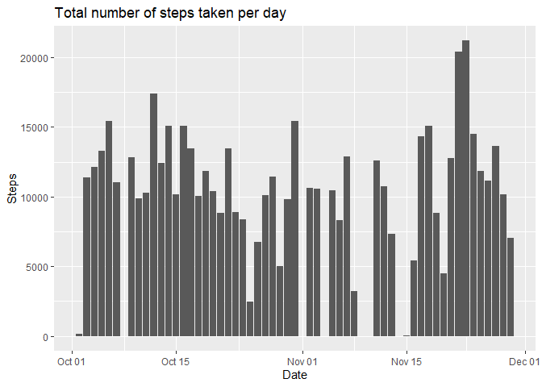
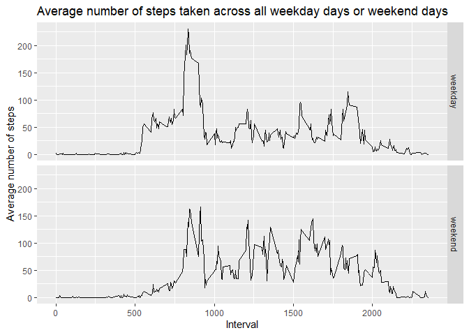

## Loading and preprocessing the data
If the directory doesn't contain file "activity.csv", the "activity.zip" is unzipped. The dataset is stored in a variable "activity". The format of the date column is changed to %Y-%m-%d.

```r
#setting local language to English
Sys.setlocale("LC_ALL", "English")
```

```
## Warning in Sys.setlocale("LC_ALL", "English"): using locale code page other
## than 65001 ("UTF-8") may cause problems
```

```
## [1] "LC_COLLATE=English_United States.1252;LC_CTYPE=English_United States.1252;LC_MONETARY=English_United States.1252;LC_NUMERIC=C;LC_TIME=English_United States.1252"
```

```r
#loading the dataset
if (!("activity.csv" %in% dir())) unzip("activity.zip")
activity <- read.csv("activity.csv")
#changing the date column format
activity$date <- as.Date(activity$date, "%Y-%m-%d")
```


## What is mean total number of steps taken per day?
To calculate total number of steps taken per day, the aggregate function was used, which by default is to ignore missing values in the given variables. Histogram was created by using ggplot2 plotting system.

```r
#installing ggplot2 package
if (!("ggplot2") %in% installed.packages()) install.packages("ggplot2")
library(ggplot2)
#calculating the total number of steps taken per day
total_steps <- aggregate(steps ~ date, activity, sum)
#creating a histogram
ggplot(total_steps, aes(x = total_steps$date, y = total_steps$steps))+ geom_histogram(stat = "identity")+ labs(title = "Total number of steps taken per day", x ="Date", y = "Steps")
```

```
## Warning in geom_histogram(stat = "identity"): Ignoring unknown parameters:
## `binwidth`, `bins`, and `pad`
```

```
## Warning: Use of `total_steps$date` is discouraged.
## i Use `date` instead.
```

```
## Warning: Use of `total_steps$steps` is discouraged.
## i Use `steps` instead.
```

<!-- -->

```r
#calculating mean and median of the total number of steps taken per day
mean(total_steps$steps)
```

```
## [1] 10766.19
```

```r
median(total_steps$steps)
```

```
## [1] 10765
```
Mean of the total number of steps taken per day is 10766.19

Median of the total number of steps taken per day is 10765

## What is the average daily activity pattern?
To calculate the average number of steps taken in a 5 minute interval, the aggregate function was used, which by default is to ignore missing values in the given variables. A time series plot was created by using ggplot2 plotting system.

```r
#calculating the average number of steps taken in a 5 minute interval
avg_steps <- aggregate(steps ~ interval, activity, mean)
#creating a time series plot
ggplot(avg_steps, aes(x=interval, y = steps))+geom_line()+ labs(title = "Average number of steps in 5 minute intervals", x ="Time interval", y = "Average number of steps")
```

<!-- -->

```r
#finding interval with maximum average number of steps
avg_steps[avg_steps$steps == max(avg_steps$steps),]
```

```
##     interval    steps
## 104      835 206.1698
```
The 835 interval contains the maximum number of steps, on average across all the days in the dataset.

## Imputing missing values
The missing values have been ignored before.
The presence of missing days may introduce bias into some calculations or summaries of the data.

```r
sum(is.na(activity))
```

```
## [1] 2304
```
The total number of missing values is 2304.

To create a new dataset, the missing values are going to be filled in by the mean of the corresponding interval. 

```r
#calculating the average number of steps taken in a 5 minute interval
avg_steps <- aggregate(steps ~ interval, activity, mean)

#creating a new dataset acitivity_fNA with missing values filled in
activity_fNA <- activity
for (i in 1:nrow(activity_fNA)){
  activity_fNA$steps[i] <- ifelse(is.na(activity_fNA$steps[i]), avg_steps$steps[avg_steps$interval == activity_fNA$interval[i]], activity_fNA$steps[i])
}
```
A histogram of the total number of steps taken each day was created by using ggplot2 plotting system.


```r
#calculating the total number of steps taken per day
total_steps_fNA <- aggregate(steps ~ date, activity_fNA, sum)
#creating a histogram
ggplot(total_steps_fNA, aes(x = total_steps_fNA$date, y = total_steps_fNA$steps))+ geom_histogram(stat = "identity")+ labs(title = "Total number of steps taken per day for a dataset with filled in missing values", x ="Date", y = "Steps")
```

```
## Warning in geom_histogram(stat = "identity"): Ignoring unknown parameters:
## `binwidth`, `bins`, and `pad`
```

```
## Warning: Use of `total_steps_fNA$date` is discouraged.
## i Use `date` instead.
```

```
## Warning: Use of `total_steps_fNA$steps` is discouraged.
## i Use `steps` instead.
```

<!-- -->

```r
#calculating mean and median of the total number of steps taken per day for dataset with filled in missing values and a mean and median difference between datasets with and without missing values
mean(total_steps_fNA$steps)
```

```
## [1] 10766.19
```

```r
median(total_steps_fNA$steps)
```

```
## [1] 10766.19
```

```r
mean(total_steps_fNA$steps) - mean(total_steps$steps)
```

```
## [1] 0
```

```r
median(total_steps_fNA$steps) - median(total_steps$steps)
```

```
## [1] 1.188679
```
Mean of the total number of steps taken per day is 10766.19

Median of the total number of steps taken per day is 10766.19

Mean of a dataset with and without missing values is the same. Median of the dataset with filled in missing values is 1.188679 higher than median of the original dataset. Filling in missing values resulted in creating a dataset with a symmetrical distribution without outliers.

## Are there differences in activity patterns between weekdays and weekends?

For this step of the analysis, additional variable "day_type", that distinguishes a weekday from a weekend, is added to a dataset with filled in missing values.

```r
#creating a new factor variable in the dataset with two levels “weekday” and “weekend” indicating whether a given date is a weekday or weekend day
activity_fNA["day_type"] <- ifelse(weekdays(activity_fNA$date) %in% c("Saturday", "Sunday"), "weekend", "weekday")
#calculating average steps taken in interval across weekday days or weekend days
avg_by_daytype <- aggregate(steps~interval+day_type, activity_fNA, mean)
#creating a time series plot
ggplot(data = avg_by_daytype) + geom_line(aes(interval,steps)) + facet_grid(day_type~.) + labs(title = "Average number of steps taken across all weekday days or weekend days", x = "Interval", y = "Average number of steps")
```

<!-- -->
